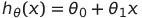
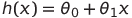
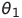
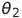
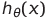
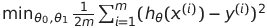
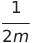
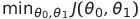
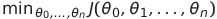

##单一变量的线性回归
### 序
**训练集** ：在监督式学习中，数据集被称为训练集
   
把训练集作为学习算法的输入，算法的输出为一个函数，习惯用h表示（hypothesis），在单一变量的线性回归模型中，h为带有一个变量x的线性函数：

简写为：

### Cost Function
#### 概述
我们的目标是：   
选择合适的和，让尽可能接近y(也即是是前面所述的“right answer”)

把上述目标规范化，其实是一个最小化问题：    
    
解释：
前面加上是为了让计算更加简单

更近一步地，定义：    
    
为代价函数，则我们的目标为：    

这样的代价函数也被称为`squared error function`或`square error cost function`。    
选择这种形式的函数作为代价函数被证明是合理的，并且适合大多数问题，用的也很普遍。当然也有其他形式的代价函数。

#### Cost Function的几何含义
和一确定，就唯一确定了hypothesis，其对应一条直线。我们的目标是找出和，使训练集中的各个点到hypothesis的垂直距离的平方和最小。

### Gradient descent algorithm
梯度下降算法不仅仅用于线性回归，在机器学习中到处都有用到。

可以证明梯度下降法可以用于求解这样的问题。

步骤（不妨假设J有两个自变量）：

- 开始时先猜测和的值（初始值，通常都设为0）
- 不断改变和，来减小J，直到达到一个最小值或极小值