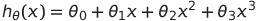
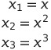
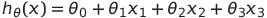
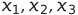

## 多个变量的线性回归
### 基本形式

为了记号方便，令，

并令，，

则有：

最后这种形式的线性回归又被称为`Multivariate linear regression`

### 梯度下降法在多个变量的线性回归中的应用
Repeat {    
	    
	(simultaneously update for j=0,...,n)    
}

### 多变量线性回归中一些有用的技巧
#### 让处于大致相同的数值范围
这样，会大致成为一个圆形的碗（以两个变量为例），而不是椭圆形的碗，能加快算法的收敛。

根据实际经验，尽量让每个变量都处于。
但这不是固定的，例如在0和3之间、-2和0.5之间，范围均相差不大，但是如果一个变量的变化范围在-100和100之间，就需要对这个变量做一些处理。当然也不能太小，例如在-0.000001和0.0000001之间也需要做一些处理。

通常处理的方法为：    
    
其中：

- 为训练集中的平均值   
- 为训练集中的变化范围（max - min）

#### 算法的调试 & 关于学习率
如果算法正确，那么每一次迭代后，都会变小。

如果某一次迭代减少的值小于，则算法可以宣告收敛。

总结：

- 如果太小，则算法可能收敛的非常慢，经过超多次迭代才收敛
- 如果太大，则算法可能会越过最小值，可能会出现随着算法迭代，变大的情况

根据实际经验，在选择时，可以尝试..., 0.001, 0.003, 0.01, 0.03, 0.1, 0.3, 1...等等

### Data Features（变量）与多项式回归
#### Data Features
有时候，可以对已知的变量稍作调整，用他们构建新的变量，让模型变得更好。    
例如，已知房子的长和宽和对应的价格，用这些来做线性回归时，完全可以找出影响房子价钱的决定因素为房子的面积而非长和宽，则可以用一个新的变量——房屋面积来代替长和宽这两个变量来做回归。

#### 多项式回归
一些问题可以间接地转化为线性回归的问题来做，例如：

可以将其转化为线性回归问题：

令：

则原问题变为：

在做这种转换时，要尤其注意经过转化的范围问题，因为平方可能会让转换后的变量变化范围不协调，可以用上面提到的小技巧进行调整。

### 线性回归的标准方程法（Normal Equation）
到目前为止，我们求解的线性回归的梯度下降算法是迭代算法，而Normal Equation方式是一种分析求解的方法，而非迭代求解。

例如一个二次函数，取得最小值的点为使其导函数值为0的点。

则只需要让线性回归中代价函数对（j=0,1...n）求偏导后等于0，解出一系列方程即可。

