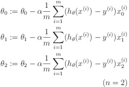
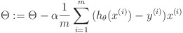
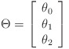
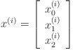

### Condition Statements

#### for 

下面的代码依次将向量v中每个元素变成2的i次幂。

```
>> v = zeros(1, 10);
>> for i=1:10
>> v(i) = 2^i;
>> end;
```

`continue`和`break`均可在循环中使用。

#### while

下面的代码将向量v的前5个元素改为100.

```
>> i = 1; % 记得初始化i，还要记得下标从1开始
>> while i <= 5,
>> v(i) = 100;
>> i = i + 1;
>> end;
```

#### if 

以下代码演示了if结合break的用法。

```
>> i = 1;
>> while true,
>>  v(i) = 999;
>>  i = i + 1;
>>  if i == 6,
>>   break;
>>  end; % end if从句
>> end;
```

`elseif`和`else`。

```
>> if v(1) == 1,
>> 	disp('');
>> elseif v(1) == 2,
>> 	disp('');
>> else
>> 	disp('');
>> end;
``` 

#### 函数

在Octave中定义函数需要建一个以函数名字命名的文件，后缀名是`.m`。当Octave找到这个文件，就会去文件中找函数的定义。 

以下示例代码定义了一个函数，y是返回值，x是参数。

```
function y = squareThisNumber(x)

y = x^2
```

可以使用`addpath()`来将某个路径加入到Octave的Search Path中。这样每次不用将Octave cd到该Path，也能找到该Path下的文件。

Octave支持多个返回值的函数。以下示例代码是一个有两个返回值的函数。

```
function [y1, y2] = squareAndCubeThisNumber(x)

y1 = x^2;
y2 = x^3;
```

以下函数是线性回归的代价函数，**要好好理解**。

```
function J = costFunction(X, y, theta)

m = size(m, 1);
predictions = X * theta;
sqrErrors = (predictions - y) .^ 2;

J = 1/(2*m) * sum(sqrErrors);
```

#### 向量化

在计算线性回归的假设函数时：


可以用向量化的实现和for循环实现，用循环实现效率低下且代码丑陋，直接用向量实现代码简单优雅，而且Octave会高度优化。

```
prediction = 0.0;
for j = 1:n+1,
	prediction = prediction + theta(j) * x(j);
end;
```

向量化的实现：

```
prediction = theta' * x;
```

不仅仅是在Octave中，在Matlab中、以及C++或者Python中，使用一些线性代数的lib，进而使用向量化的实现，效率都会更高，代码也会更优雅。

下面是一个更复杂的例子。

在有两个变量的线性回归中，梯度下降法中的核心表达式如下：



用for循环可以很容易实现他们，但是用向量化的方法，我们不难得到如下表达式：



其中：





#### 使用`submit`提交作业

去coursera上下载作业，添加上我们的代码，确认无误后，使用作业中的`submit()`函数，按照出现的提示，输入并提交作业。