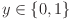
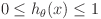
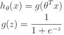
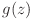
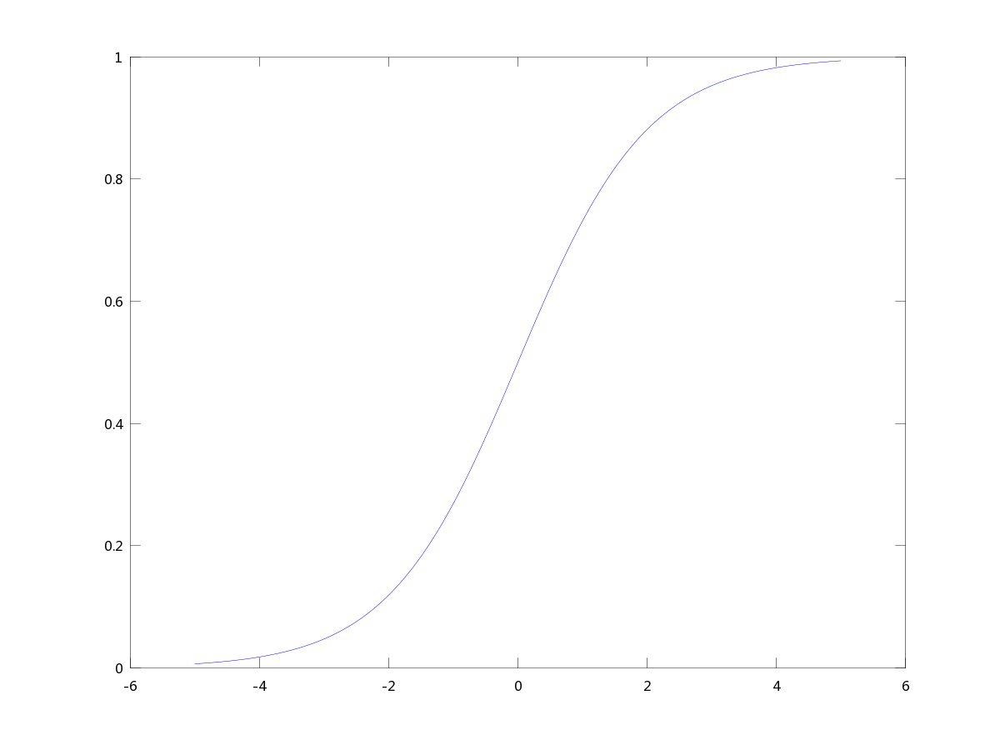
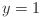
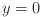
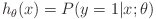
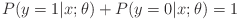

### 分类

举例：

- Email：是垃圾邮件/不是垃圾邮件？
- 在线请求：是欺骗性的/不是欺骗性的？
- 癌症：是良性的/不是良性的？

在上面的例子中，我们想预测的变量Y是一个二值的，也即：



y的取值也被称为：

- 0  "Negative Class"
- 1  "Positive Class"

0和1哪个是Negative哪个是Positive不是很重要。

当y的取值不仅仅是二值时，这样的分类问题被称为多种类分类问题。

如果我们在分类问题上，继续应用前面所学过的线性回归的相关算法，会发现假设（）不能很好的预测结果（因为y是二值的），而的输出值既可能比1大，也可能比0小，不能很好的匹配，这是很显然的。

因此我们需要一个新的算法——Logistic Regression来解决分类问题。不要'Regression'所迷惑，虽然名字里面带有回归二字，但它是一个分类算法。

### 逻辑回归模型

#### 提出模型

要求假设满足：



我们对线性回归的假设函数做一些修改：



其中被称为*Sigmoid function*或*Logistic function*。

这个函数用Octave画出图像如下图所示：

```
>> x = [-5:0.01:5];
>> y = 1 ./ (1 .+ e .^ (-x)) ;
>> plot(x, y)
```



其中和是该函数的两条渐近线。此外在画图的时候，要注意，可能Octave将数值运算自动当成了矩阵运算，因此所有运算加个'.'就可以了。

在Logistic回归中，我们的假设函数也即：

。

其取值在0和1之间。与以往一样，我们的任务是选取一组参数，是其尽可能的满足训练集。


#### 模型解释

是在**给定的输入x下，y=1的可能性的估计**。（estimated probability that y=1 on input x）。

用数学公式来表示：



这个式子的含义为：当假设的参数确定为时，给定一个输入x，y=1的概率的估计。

而由于y只能取两个值（0或者1），因此下式成立：




