### Cost Function

回顾一下，在Logistic回归中，与线性回归类似，我们已知了其假设函数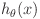的形式，要根据训练集确定的参数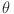。那么怎么确定呢？我们是通过代价函数Cost Function。

在线性回归中，我们的代价函数如下所示：

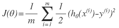

令：


则线性回归的代价函数为：

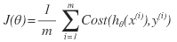。

而在Logistic回归中，如果我们用同样的代价函数，由于是一个较为复杂的非线性函数，我们会发现Cost函数不是一个凸函数（non-convex），因此通过梯度下降算法找到的可能不是最小值而是一个局部极小值。

在Logistic回归中采用的Cost Function如下所示：

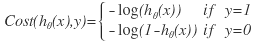

当y=1时，函数为：

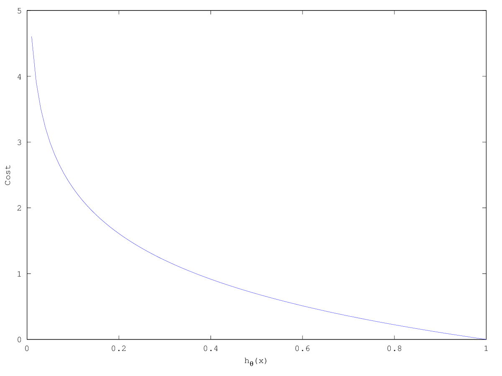

只观察这一个函数，我们可以发现以下规律：

当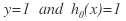时，说明做出了精确的预测，此时Cost的值为0；

但是当：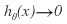时，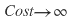，因为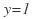，也就是说实际的y值为1，结果我们的假设函数做出了0的预测，代价显然是无穷大。

当y=0时，函数图像为：

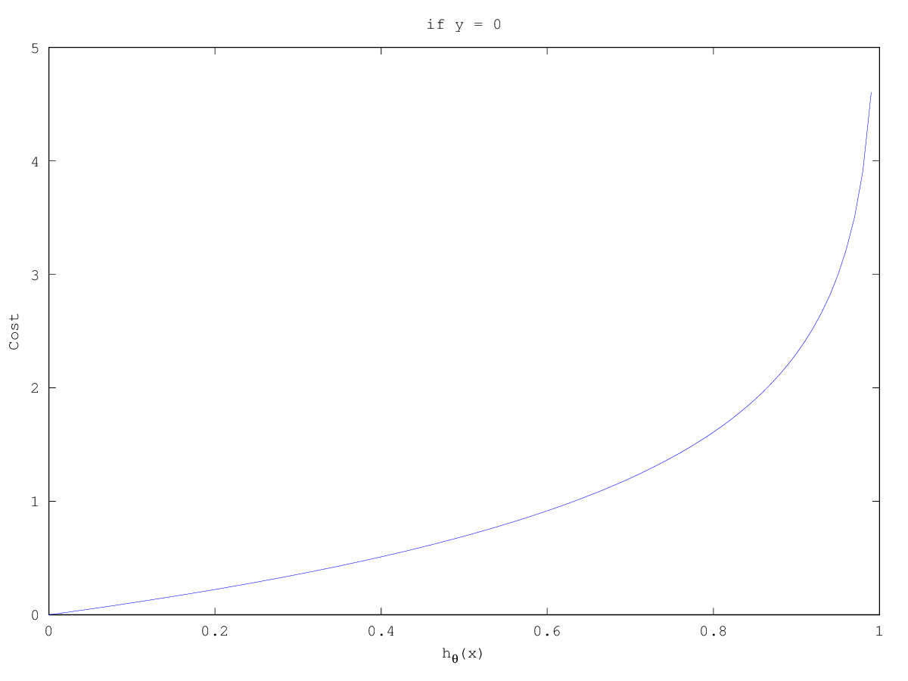

我们可以发现与y=1时相类似的规律。

### Simplified Cost Function and Gradient Descent

我们可以用一种简单的写法将Logistic回归中的代价函数写成一个（注意在Logistic回归中，y的取值要么是0要么是1）：

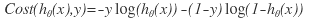

因此，Logistic回归的代价函数就可以写为：

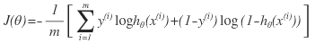

回顾一下我们的目标是通过某种方法找到一个，使Cost Function有最小值：

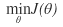

#### 梯度下降算法

在梯度下降算法的基本形式为：

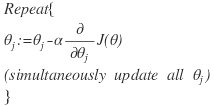

把Logistic回归的代价函数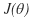代入上式，计算偏导，发现Logistic回归的梯度下降算法最终的计算式与线性回归相同：

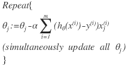

那么这么看来Logistic回归与线性回归在应用梯度下降算法上貌似没有区别？

其实不是的，注意，两种回归不一样的地方是，也即假设函数。在梯度下降算法的算式中，虽然形式一模一样，但是在线性回归中，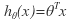，而在Logistic回归中，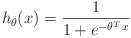，因此，他们梯度下降算法的算式是完全不一样的。

如果我们想在Octave中实现梯度下降，别忘了将其向量化：


最后，在线性回归中应用梯度下降算法时，我们曾经讲过要将各个features的范围调整到差不多的方法，以加快梯度下降算法的收敛，在Logistic回归这里，那些方法同样适用。

### Advanced Optimization

本节介绍一些高级的优化算法，这些算法能够使Logistic回归中使用的梯度下降算法运行的更快，在训练集非常大的时候显得很有用。

在梯度下降算法中，我们的代码需计算出以下算式：

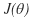

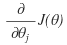 (for j=0, 1, ... , n)

那么也就是说，对于梯度下降算法来说，我们需要提供可以计算出以上两个算式的代码的支持，然后把他们代入到梯度下降算法中：


实际上，有了计算以上两个算式的代码，我们可以用的不仅仅是梯度下降法，还有很多更优化的算法：

- Gradient descent
- Conjugate gradient
- BFGS
- L-BFGS

下面三种算法不在本课的范畴。

这些算法的优点有：

- 不需要人工选取learning rate
- 比梯度下降法快

缺点是有一些复杂。

我们现在可以认为这些算法的循环里面的代码更加优秀，实际上它们使用了一种被称为线性搜索算法的算法，自动尝试不同的learning rate，并选择一个合适的值。

通常，我们是不需要自己去实现这些算法的，只需要使用现成的lib即可。Octave还有matlab都有实现这些高级算法的库。需要注意的是，不同的库及不同的语言在实现这些高级算法上性能是有所不同的，我们需要尝试着找到一个好的库。

例如：

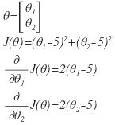

这个例子我们很容易得知能使取得最小值的为。

在Octave中使用这些算法时，需要写一个函数，这个函数接受一个参数theta，返回代价函数以及（被称为梯度gradient）矩阵。

```
function [jVal, gradient] = costFunction(theta)
jVal = (theta(1) - 5) ^ 2 + (theta(2) - 5) ^ 2;
gradient = zeros(2, 1);
gradient(1) = 2 * (theta(1) - 5);
gradient(2) = 2 * (theta(2) - 5);
```

接着在Octave中应用这些算法：

```
options = optimset('GradObj', 'on', 'MaxIter', '100') % 参数集合，指定了gradient参数为on（也即会为算法提供gradient参数），最大迭代次数为100次
initialTheta = zeros(2, 1); % theta的初始值，注意要求theta的维度必须正确
[optTheta, functionVal, exitFlag] = fminunc(@costFuction, initialTheta, options); % 会应用一些高级的算法求解costFunction的最小值，exitFlag标志算法是否收敛（收敛为1）。
```

